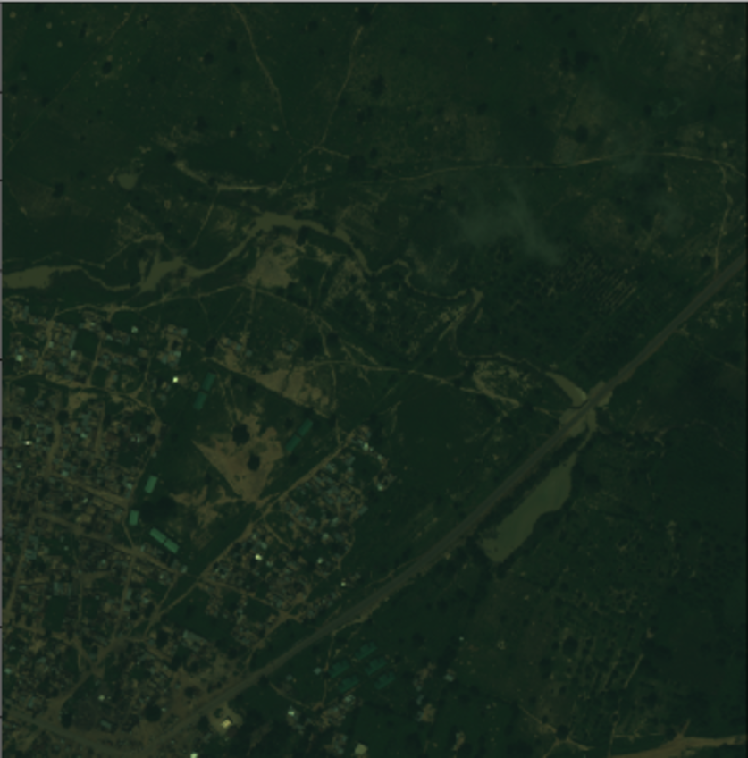
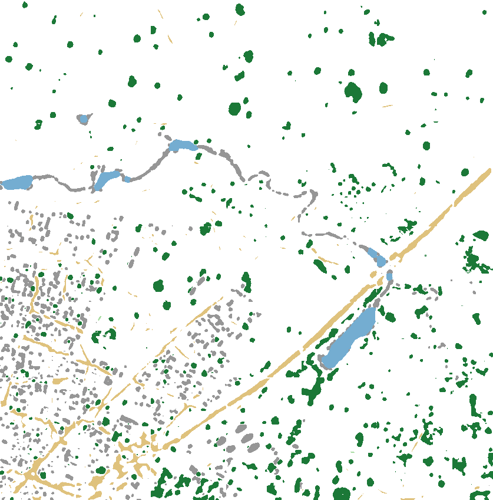

# Semantic Segmentation of Multispectral Satellite Imagery using U-Nets

Google Colab notebook for the project: https://colab.research.google.com/drive/1KZYHSEZ2q8u1l5HZiL83FjkJuv8xXvyB

Based on https://github.com/reachsumit/deep-unet-for-satellite-image-segmentation


## The model
U-Nets were introduced by Ronneberger et al. in 2015 for biomedical image segmentation (https://arxiv.org/abs/1505.04597) and have proven to be an effective model for image segmentation in domains other than medicine. The model used in this project is defined in `unet.py`. It uses transpose convolution layers for upsampling (can also be done by bilinear upsampling) and batch normalization between layers. The summary of the model is given below.
```
__________________________________________________________________________________________________
Layer (type)                    Output Shape         Param #     Connected to                     
==================================================================================================
input_1 (InputLayer)            [(None, 128, 128, 8) 0                                            
__________________________________________________________________________________________________
conv2d (Conv2D)                 (None, 128, 128, 32) 2336        input_1[0][0]                    
__________________________________________________________________________________________________
conv2d_1 (Conv2D)               (None, 128, 128, 32) 9248        conv2d[0][0]                     
__________________________________________________________________________________________________
max_pooling2d (MaxPooling2D)    (None, 64, 64, 32)   0           conv2d_1[0][0]                   
__________________________________________________________________________________________________
batch_normalization (BatchNorma (None, 64, 64, 32)   128         max_pooling2d[0][0]              
__________________________________________________________________________________________________
conv2d_2 (Conv2D)               (None, 64, 64, 64)   18496       batch_normalization[0][0]        
__________________________________________________________________________________________________
conv2d_3 (Conv2D)               (None, 64, 64, 64)   36928       conv2d_2[0][0]                   
__________________________________________________________________________________________________
max_pooling2d_1 (MaxPooling2D)  (None, 32, 32, 64)   0           conv2d_3[0][0]                   
__________________________________________________________________________________________________
dropout (Dropout)               (None, 32, 32, 64)   0           max_pooling2d_1[0][0]            
__________________________________________________________________________________________________
batch_normalization_1 (BatchNor (None, 32, 32, 64)   256         dropout[0][0]                    
__________________________________________________________________________________________________
conv2d_4 (Conv2D)               (None, 32, 32, 128)  73856       batch_normalization_1[0][0]      
__________________________________________________________________________________________________
conv2d_5 (Conv2D)               (None, 32, 32, 128)  147584      conv2d_4[0][0]                   
__________________________________________________________________________________________________
max_pooling2d_2 (MaxPooling2D)  (None, 16, 16, 128)  0           conv2d_5[0][0]                   
__________________________________________________________________________________________________
dropout_1 (Dropout)             (None, 16, 16, 128)  0           max_pooling2d_2[0][0]            
__________________________________________________________________________________________________
batch_normalization_2 (BatchNor (None, 16, 16, 128)  512         dropout_1[0][0]                  
__________________________________________________________________________________________________
conv2d_6 (Conv2D)               (None, 16, 16, 256)  295168      batch_normalization_2[0][0]      
__________________________________________________________________________________________________
conv2d_7 (Conv2D)               (None, 16, 16, 256)  590080      conv2d_6[0][0]                   
__________________________________________________________________________________________________
max_pooling2d_3 (MaxPooling2D)  (None, 8, 8, 256)    0           conv2d_7[0][0]                   
__________________________________________________________________________________________________
dropout_2 (Dropout)             (None, 8, 8, 256)    0           max_pooling2d_3[0][0]            
__________________________________________________________________________________________________
batch_normalization_3 (BatchNor (None, 8, 8, 256)    1024        dropout_2[0][0]                  
__________________________________________________________________________________________________
conv2d_8 (Conv2D)               (None, 8, 8, 512)    1180160     batch_normalization_3[0][0]      
__________________________________________________________________________________________________
conv2d_9 (Conv2D)               (None, 8, 8, 512)    2359808     conv2d_8[0][0]                   
__________________________________________________________________________________________________
max_pooling2d_4 (MaxPooling2D)  (None, 4, 4, 512)    0           conv2d_9[0][0]                   
__________________________________________________________________________________________________
dropout_3 (Dropout)             (None, 4, 4, 512)    0           max_pooling2d_4[0][0]            
__________________________________________________________________________________________________
conv2d_10 (Conv2D)              (None, 4, 4, 1024)   4719616     dropout_3[0][0]                  
__________________________________________________________________________________________________
conv2d_11 (Conv2D)              (None, 4, 4, 1024)   9438208     conv2d_10[0][0]                  
__________________________________________________________________________________________________
conv2d_transpose (Conv2DTranspo (None, 8, 8, 512)    2097664     conv2d_11[0][0]                  
__________________________________________________________________________________________________
concatenate (Concatenate)       (None, 8, 8, 1024)   0           conv2d_transpose[0][0]           
                                                                 conv2d_9[0][0]                   
__________________________________________________________________________________________________
batch_normalization_4 (BatchNor (None, 8, 8, 1024)   4096        concatenate[0][0]                
__________________________________________________________________________________________________
conv2d_12 (Conv2D)              (None, 8, 8, 512)    4719104     batch_normalization_4[0][0]      
__________________________________________________________________________________________________
conv2d_13 (Conv2D)              (None, 8, 8, 512)    2359808     conv2d_12[0][0]                  
__________________________________________________________________________________________________
dropout_4 (Dropout)             (None, 8, 8, 512)    0           conv2d_13[0][0]                  
__________________________________________________________________________________________________
conv2d_transpose_1 (Conv2DTrans (None, 16, 16, 256)  524544      dropout_4[0][0]                  
__________________________________________________________________________________________________
concatenate_1 (Concatenate)     (None, 16, 16, 512)  0           conv2d_transpose_1[0][0]         
                                                                 conv2d_7[0][0]                   
__________________________________________________________________________________________________
batch_normalization_5 (BatchNor (None, 16, 16, 512)  2048        concatenate_1[0][0]              
__________________________________________________________________________________________________
conv2d_14 (Conv2D)              (None, 16, 16, 256)  1179904     batch_normalization_5[0][0]      
__________________________________________________________________________________________________
conv2d_15 (Conv2D)              (None, 16, 16, 256)  590080      conv2d_14[0][0]                  
__________________________________________________________________________________________________
dropout_5 (Dropout)             (None, 16, 16, 256)  0           conv2d_15[0][0]                  
__________________________________________________________________________________________________
conv2d_transpose_2 (Conv2DTrans (None, 32, 32, 128)  131200      dropout_5[0][0]                  
__________________________________________________________________________________________________
concatenate_2 (Concatenate)     (None, 32, 32, 256)  0           conv2d_transpose_2[0][0]         
                                                                 conv2d_5[0][0]                   
__________________________________________________________________________________________________
batch_normalization_6 (BatchNor (None, 32, 32, 256)  1024        concatenate_2[0][0]              
__________________________________________________________________________________________________
conv2d_16 (Conv2D)              (None, 32, 32, 128)  295040      batch_normalization_6[0][0]      
__________________________________________________________________________________________________
conv2d_17 (Conv2D)              (None, 32, 32, 128)  147584      conv2d_16[0][0]                  
__________________________________________________________________________________________________
dropout_6 (Dropout)             (None, 32, 32, 128)  0           conv2d_17[0][0]                  
__________________________________________________________________________________________________
conv2d_transpose_3 (Conv2DTrans (None, 64, 64, 64)   32832       dropout_6[0][0]                  
__________________________________________________________________________________________________
concatenate_3 (Concatenate)     (None, 64, 64, 128)  0           conv2d_transpose_3[0][0]         
                                                                 conv2d_3[0][0]                   
__________________________________________________________________________________________________
batch_normalization_7 (BatchNor (None, 64, 64, 128)  512         concatenate_3[0][0]              
__________________________________________________________________________________________________
conv2d_18 (Conv2D)              (None, 64, 64, 64)   73792       batch_normalization_7[0][0]      
__________________________________________________________________________________________________
conv2d_19 (Conv2D)              (None, 64, 64, 64)   36928       conv2d_18[0][0]                  
__________________________________________________________________________________________________
dropout_7 (Dropout)             (None, 64, 64, 64)   0           conv2d_19[0][0]                  
__________________________________________________________________________________________________
conv2d_transpose_4 (Conv2DTrans (None, 128, 128, 32) 8224        dropout_7[0][0]                  
__________________________________________________________________________________________________
concatenate_4 (Concatenate)     (None, 128, 128, 64) 0           conv2d_transpose_4[0][0]         
                                                                 conv2d_1[0][0]                   
__________________________________________________________________________________________________
conv2d_20 (Conv2D)              (None, 128, 128, 32) 18464       concatenate_4[0][0]              
__________________________________________________________________________________________________
conv2d_21 (Conv2D)              (None, 128, 128, 32) 9248        conv2d_20[0][0]                  
__________________________________________________________________________________________________
conv2d_22 (Conv2D)              (None, 128, 128, 5)  165         conv2d_21[0][0]                  
==================================================================================================
Total params: 31,105,669
Trainable params: 31,100,869
Non-trainable params: 4,800
__________________________________________________________________________________________________
```

## Input data
Input images are taken from SpaceNet challenge dataset. Dataset consists of 24 8-band (red, red edge, coastal, blue, green, yellow, near-IR1 and near-IR2) 16-bit TIF images. Each image is sliced into patches in order to fit in memory, otherwise even GPUs cannot handle the training. Below is an example image from the training dataset.



## Output
The model outputs a segmentation map i.e. a 3D tensor of shape (height, width, number_of_classes) where 3rd dimension is the probability distribution among classes. This output map is then converted to an RGB image using color coding for different classes:

|   Class label   |     RGB color     |
|:--------------- |:-----------------:|
| Buildings       | `(150, 150, 150)` |
| Roads & Tracks  | `(223, 194, 125)` |
| Trees           | `( 27, 120,  55)` |
| Crops           | `(166, 219, 160)` |
| Water           | `(116, 173, 209)` |

A color keyed output map generated for the example input image is shown below. We can see that while the result looks promising, the class boundaries are smooth and the road segment is not fully contiguous.



**NOTE:** The network has been trained on 1200 training samples for 50 epochs and is clearly **undertrained**. More training will improve the results and make the output map more precise. Training has been done on Google Colab on a GPU which, unfortunately, does not allow lengthy computations.
